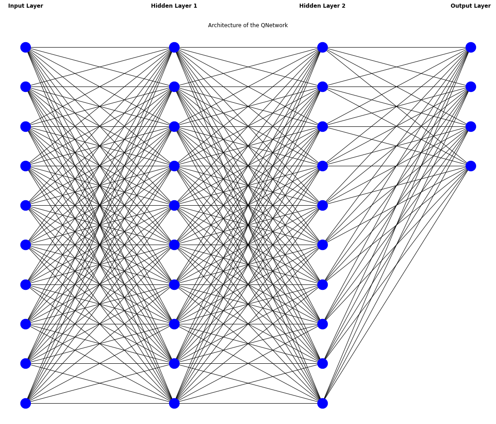
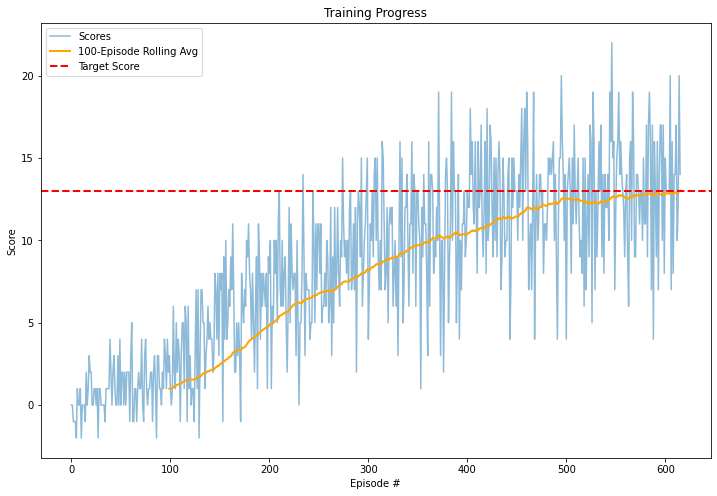
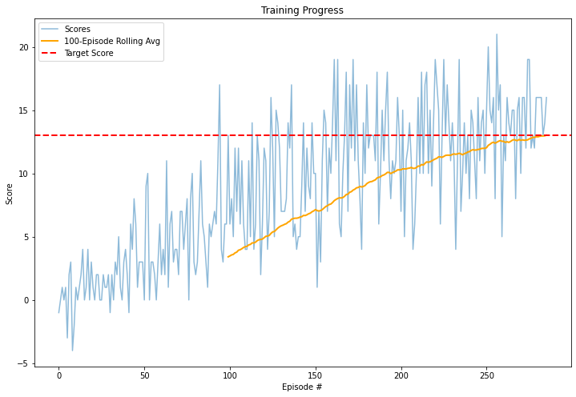

# Learning Algorithm

The QNetwork, which we already implemented earlier in this course, was utilized as model for solving the banana collector problem. This QNetwork consits of an input layer representing the number of states (37), two hidden layers, both with 64 nodes, followed by an output layer, consisting of the amount of available actions (4). The output layer produces the final q-value for all possible actions. Both hidden Layers are followed by a ReLu activation function. The following graphic represents a less complex depiction of the model architecture of the QNetwork (e.g. the input layer should have 37 nodes and the two hidden layers should each have 64 nodes).



The following code snippet represents this visual architecture.

```bash
class QNetwork(nn.Module):
    """Actor (Policy) Model."""

    def __init__(self, state_size, action_size, seed, fc1_units=64, fc2_units=64):
        """Initialize parameters and build model.
        Params
        ======
            state_size (int): Dimension of each state
            action_size (int): Dimension of each action
            seed (int): Random seed
            fc1_units (int): Number of nodes in first hidden layer
            fc2_units (int): Number of nodes in second hidden layer
        """
        super(QNetwork, self).__init__()
        self.seed = torch.manual_seed(seed)
        self.fc1 = nn.Linear(state_size, fc1_units)
        self.fc2 = nn.Linear(fc1_units, fc2_units)
        self.fc3 = nn.Linear(fc2_units, action_size)

    def forward(self, state):
        """Build a network that maps state -> action values."""
        x = F.relu(self.fc1(state))
        x = F.relu(self.fc2(x))
        return self.fc3(x)

```

# Plot of Rewards

Two training trials with a DQN-Agent have been made. In both trials, the agent achieved relative quickly the 100-episode average score of 13.0. Furthermore, in the first trial, a maximum number of timesteps per episode of 1000, an epsilon start for the epsilon-greedy action selection of 1.0, a minimum value for epsilon of 0.01, and an epsilion decay of 0.995 was selected. The agend achieved the target score after more than 600 episodes. The respective weigths can be found in the following file: The file `results/chechpoint_01.pth` containtes the weights of this trial.



The second trial represents another Training Trial, but with different Parameters for the DQN. After the 286 Episode the agent reached the respecive goal of an average score of 13.0 over 100 episodes. Thus, this agent achieved the target score the fastest so far. Further the epsilon decay was reduced for this trail to 0.9, and the minimum value for epsilon was increased to 0.02. Finally, the maximum number of timesteps per episode was increased to 1200. In the plot below one can see the Scores during the training progress. The weights for this trail can be found here: `results/chechpoint_02.pth`



# Ideas for Future Work

Van Hasselt et al. (2015) demonstrate that adressing overestimations of action values from the Q-Learning algorithm, which occur in some Atari 2600 games, improves results. Given this, exploring methods to adress overestimation could be a valuable avenue for enhancing the implemented banana collector. Another promising idea could be to learn from images to navigate through the world. Therefore, one needs to design a convolutional neural network as the DQN architecture. The research of Mnih et al. (2015) provide a great inspiration for implementing such an architecture. Furthermore, Prioritized Experience Replay (PER) improves DQN by prioritizing significant experiences for replay, rather than sampling uniformly from the replay buffer (Schaul et al., 2015). This ensures that important transitions are learned more frequently, improving sample efficiency and accelerating learning (Schaul et al., 2015). Schaul et al. (2015) demonstrates that DQN with PER outperforms standard DQN in 41 out of 49 Atari games, making it a promising method to enhance DQN Learning. Thus, utilizing PER could further help to improve our current implementation. Another potential improvement for the current implementation is to integrate the dueling network architecture (e.g. Wang et al., 2015), which separates the state value function and the action advantage function. This approach enhances policy evaluation, especially when many actions have similar values, leading to more efficient learning (Wang et al., 2015). Wang et al. (2015) showed that this architecture outperforms traditional DQN in environments like Atari 2600.

Below follows a short summary of the possible future improvements for this project:
- Double Q-Learning (Van Hasselt et al. (2015))
- Learning from Pixels via Convolutional Neural Networks as the DQN architecture (Mnih et al. (2015))
- Prioritized Experience Replay (Schaul et al., 2015)
- Dueling Network Architectures for Deep Reeinforcement Learning (Wang et al., 2015)

## References
1. van Hasselt, H., Guez, A., & Silver, D. (2015). Deep Reinforcement Learning with Double Q-learning (Version 3). arXiv. https://doi.org/10.48550/ARXIV.1509.06461
2. Mnih, V., Kavukcuoglu, K., Silver, D., Rusu, A. A., Veness, J., Bellemare, M. G., Graves, A., Riedmiller, M., Fidjeland, A. K., Ostrovski, G., Petersen, S., Beattie, C., Sadik, A., Antonoglou, I., King, H., Kumaran, D., Wierstra, D., Legg, S., & Hassabis, D. (2015). Human-level control through deep reinforcement learning. In Nature (Vol. 518, Issue 7540, pp. 529–533). Springer Science and Business Media LLC. https://doi.org/10.1038/nature14236 
3. Schaul, T., Quan, J., Antonoglou, I., & Silver, D. (2015). Prioritized Experience Replay (Version 4). arXiv. https://doi.org/10.48550/ARXIV.1511.05952
4. Wang, Z., Schaul, T., Hessel, M., van Hasselt, H., Lanctot, M., & de Freitas, N. (2015). Dueling Network Architectures for Deep Reinforcement Learning (Version 3). arXiv. https://doi.org/10.48550/ARXIV.1511.06581